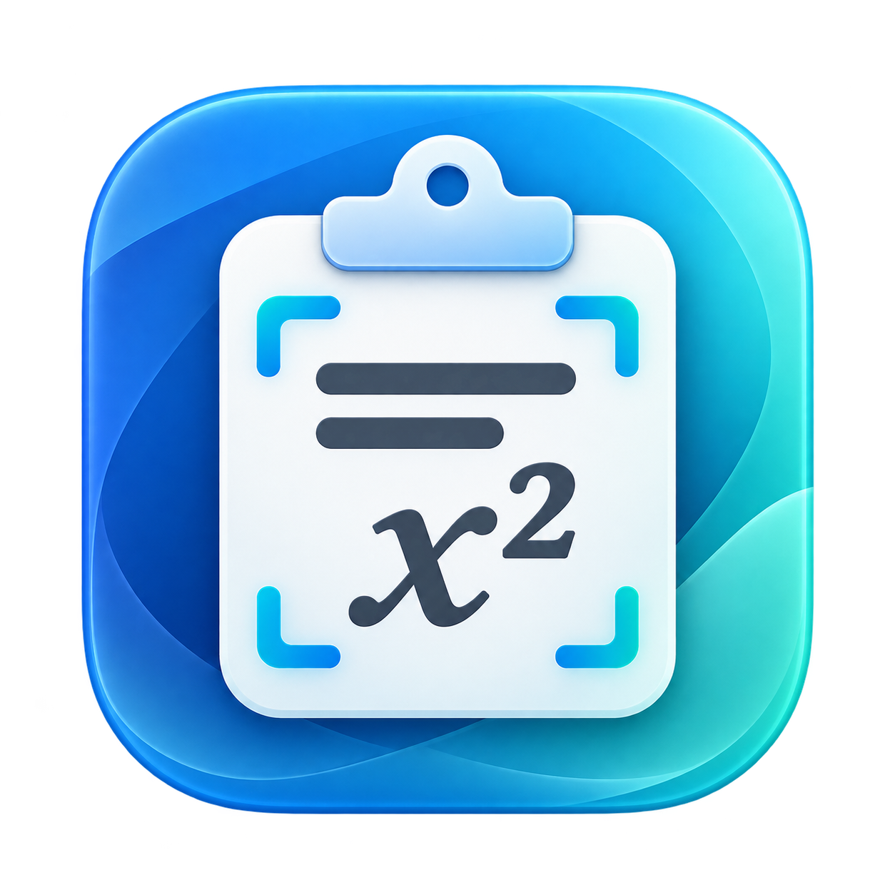
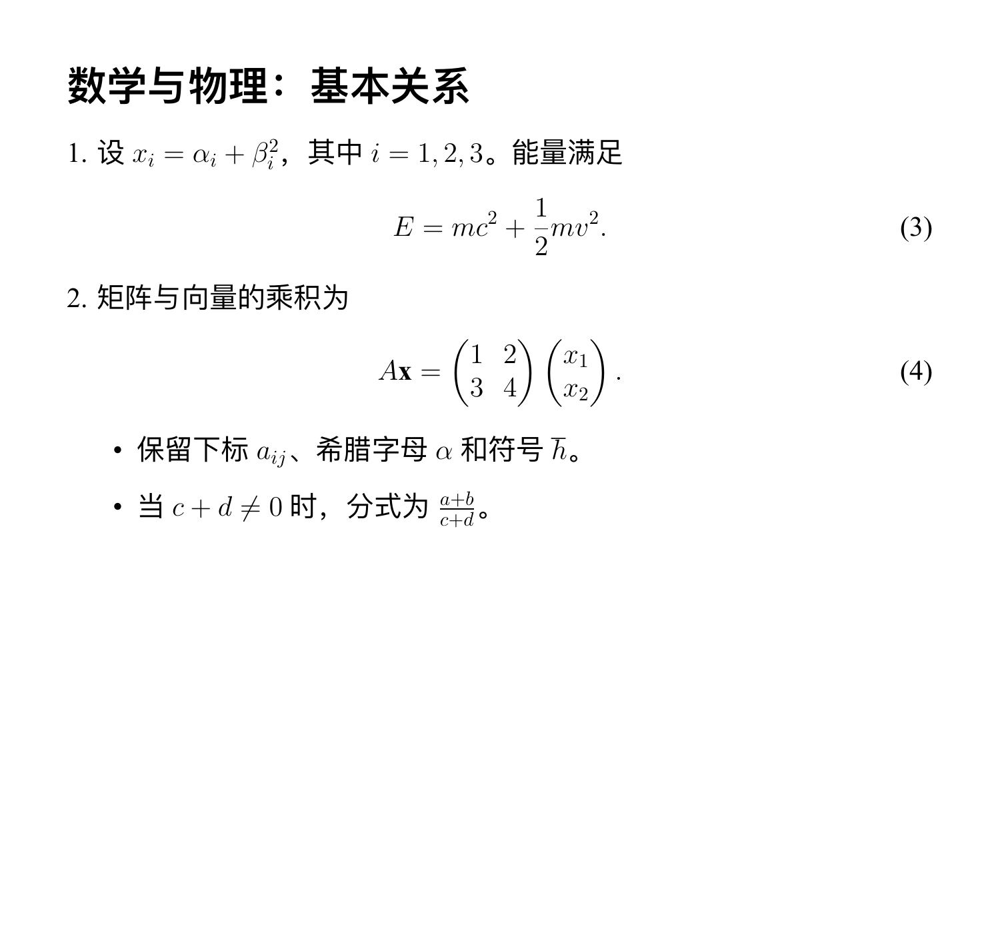
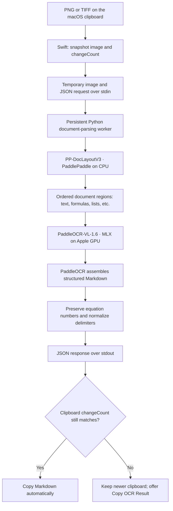

<p align="center">
  
</p>

<h1 align="center">Clipboard OCR</h1>
<p align="center"><strong>Copy an image → press a shortcut → paste Markdown with equations.</strong></p>
<p align="center">Native macOS and Windows apps · PaddleOCR-VL-1.6 · Fully local inference</p>

Clipboard OCR turns a clipboard image into editable Markdown on macOS or Windows. It handles English and Chinese paragraphs, lists, inline mathematics, and display equations through PaddleOCR’s document-parsing pipeline. Recognition runs locally, and the result replaces the clipboard only if its contents have not changed while OCR is running.

## Platform and version status

This `feature/Windows` branch contains both platform implementations. It keeps the macOS v0.1.0 source from `main` and adds a separate native Windows port; it is not one cross-platform executable.

| Platform | Status | Native app | Accelerated inference | Validated configuration |
|---|---|---|---|---|
| macOS | **v0.1.0 baseline** | SwiftUI menu-bar app | Apple Silicon / MLX Metal | M4 Pro, 48 GB, macOS 26.6.2 |
| Windows | **v0.2.0 Preview 13** | PySide6 high-DPI window and tray app | NVIDIA CUDA layout + llama.cpp Vulkan VLM | Windows 11 x64, RTX 4060 Laptop 8 GB |

The user workflow and Markdown output contract are shared, but installation, shortcuts and GPU runtimes are platform-specific. Both versions are local-only and keep no OCR history. macOS builds an ad-hoc signed `.app`; Windows Preview 13 provides an unsigned web installer that creates an isolated runtime and desktop shortcut.

## Windows quick start

### Download installer

- [Download Clipboard OCR v0.2.0 Preview 13](https://github.com/12chasse-neige/ClipboardOCR/releases/tag/v0.2.0-preview.13).
- Requires Windows 10/11 x64, an NVIDIA GPU with a current driver, about 10 GB free space, and Internet access during first setup.
- The installer bundles pinned `uv` and llama.cpp tools. It then downloads the larger Paddle/CUDA environment and official model snapshot; it is not a 6 GB offline bundle.
- The preview installer is not code-signed, so Windows may show an unknown-publisher warning. Verify the SHA-256 published with the Release before running it.

After installation, leave **Download the GPU runtime and models now** selected. When setup reports success, start **Clipboard OCR** from the desktop. It opens the main interface without a console window; once the model is ready, a lower-right notification confirms startup. Closing the main window returns it to the tray. Copy an image or use `Win+Shift+S`, press `Ctrl+Alt+O`, then paste the generated Markdown. Use **Quit** from the tray menu to stop it completely.

### Install from source

```powershell
git clone --branch feature/Windows https://github.com/12chasse-neige/ClipboardOCR.git
cd ClipboardOCR
powershell -ExecutionPolicy Bypass -File .\windows\setup.ps1
```

Source installation additionally requires [uv](https://docs.astral.sh/uv/getting-started/installation/) and Windows Package Manager (`winget`). Setup installs the managed Python interpreter, virtual environment and models under `%LOCALAPPDATA%\ClipboardOCR`; the selected directory contains only static application files and bundled tools. This avoids Windows mount-point restrictions when the app is extracted under Steam or another library volume. It performs real end-to-end GPU OCR and creates **Clipboard OCR** on the desktop. Re-running setup reuses downloaded packages and models.

The Windows preview reads the first NVIDIA GPU's VRAM and conservatively selects one slot below 7,000 MiB, two from 7,000 MiB, three from 11,000 MiB, or four from 15,000 MiB. `CLIPBOARD_OCR_CONCURRENCY=1..4` overrides this policy. It also safely handles multi-megabyte clipboard results, retries a crashed llama.cpp service once, bounds very large input images, and writes privacy-safe rotating diagnostics under `%LOCALAPPDATA%\ClipboardOCR\logs`. Only the two-slot RTX 4060 tier has been measured on real hardware; the other tiers are compatibility policies, not performance claims.

## macOS quick start

### Requirements

- An Apple Silicon Mac. Tested on **M4 Pro with 48 GB unified memory**.
- **macOS 26 or later** for this pinned runtime: the MLX 0.32.2 Metal wheels require macOS 26. The tested OS was macOS 26.6.2.
- Apple Command Line Tools, including Swift, to build the app: `xcode-select --install`.
- [uv](https://docs.astral.sh/uv/getting-started/installation/) for the isolated Python installation. For example, with Homebrew: `brew install uv`.
- Internet access for initial dependency/model setup. Allow several GB of disk space for the two runtimes, model weights, and setup downloads.

### Build and set up once

```sh
git clone https://github.com/12chasse-neige/ClipboardOCR.git
cd ClipboardOCR
./scripts/setup.command
./scripts/build.command
open "dist/Clipboard OCR.app"
```

`setup.command` installs Python 3.12.13, restores both hash-locked dependency environments, downloads the two official model snapshots at fixed revisions, and checks that the parsing pipeline and localhost MLX service can start. Quit Clipboard OCR before rerunning setup; setup recreates its two app-owned virtual environments.

`./scripts/package.command` also produces `dist/ClipboardOCR-v0.1.0-macos-arm64.zip` for a personal copy of the app.

`build.command` compiles the Swift app, builds the `.icns` icon, embeds the Python worker source, and applies an ad hoc local signature. The resulting **`dist/Clipboard OCR.app` is launchable** and can be copied to your personal Applications folder. Python packages and model weights are stored outside the bundle and remain available after moving the app.

This version is for local personal installation. It is not notarized or packaged for public distribution. Building locally avoids relying on a prebuilt executable from the repository.

### Daily use

1. Copy an image. For a macOS screenshot directly to the clipboard, press **Control–Shift–Command–4**, then select the region.
2. Press **Control–Option–Command–O** (`⌃⌥⌘O`). You can trigger recognition from another app.
3. Watch the OCR item in the menu bar: **Loading model…**, then **Recognizing…**.
4. When **Markdown copied** appears, press **Command–V** in your destination app.

You do not need to open Terminal for recognition after setup. The app copies the result; it does not type or paste into another app and does not request Accessibility permission. Clipboard access remains subject to macOS’s own clipboard controls.

Choose **Settings…** from the OCR menu to record a different shortcut. Use a key with Control or Command; if registration conflicts with another shortcut, the previous shortcut is restored. **Restore default shortcut** returns to `⌃⌥⌘O`.

### Menu actions and clipboard safety

| Action / situation | What happens |
|---|---|
| **Recognize Clipboard** | Takes a snapshot of the current PNG/TIFF image and starts recognition. |
| Repeated triggers while working | Ignored; only one recognition request runs at a time. |
| Successful recognition, clipboard unchanged | Copies Markdown automatically and briefly confirms success. |
| Clipboard changed while working | Preserves its newer contents. **Copy OCR Result** appears for an explicit copy. |
| **Copy OCR Result** | Copies the latest pending result, replacing the current clipboard only when you choose this action. |
| Empty or non-image clipboard | Shows a clear error; leaves the clipboard intact. |
| Recognition failure / missing models / backend crash | Shows an error and **Retry**. The clipboard is preserved. Retry reads the current clipboard again. |
| **Unload Model** | Stops the worker and its MLX service and releases their model processes. The next request loads again. |
| **Quit Clipboard OCR** | Shuts down all app-owned backend processes and removes any active temporary input. |

The latest successful result is held in app memory only. A new successful result replaces it; quitting discards it. Unloading the model does not erase a pending result that you may still want to copy.

## Examples: screenshots to editable text and equations

The images below are **synthetic, source-controlled test pages**, not private clipboard captures. They were typeset from [`validation/examples.tex`](validation/examples.tex), rasterized to 1500-pixel-wide PNGs, and processed by the actual full PaddleOCR-VL-1.6 → MLX backend. The Markdown shown is the recorded result after the app’s conservative formatting step, with no manual transcription corrections.

### English: numbered statements, energy, and matrices


**Recorded output:**

```markdown
## Energy and linear algebra

1. Let  $x_{i} = \alpha_{i} + \beta_{i}^{2}$ for i = 1, 2, 3. The total energy is

$$
E=m c^{2}+\frac{1}{2}m v^{2}.   \tag*{(1)}
$$

2. For a matrix $A$ and vector $\mathbf{x}$, we have

$$
A\mathbf{x}=\begin{pmatrix}1&2\\ 3&4\end{pmatrix}\begin{pmatrix}x_{1}\\ x_{2}\end{pmatrix}.   \tag*{(2)}
$$

- Preserve subscripts  $a_{ij}$ and the symbol  $\overline{h}$.

- The fraction is  $\frac{a+b}{c+d}$, with  $c+d \neq 0$.
```

[View the exact Markdown source](validation/example-1.actual.md).

**What survived:** reading order, numbered statements, Greek letters, subscripts and superscripts, the one-half fraction, both matrix rows, the column vector, and equation numbers `(1)` and `(2)`.

**Observed difference:** the input’s `\hbar` was transcribed as `\overline{h}`. This is a recognition error; the app does not silently substitute another symbol. The short inline range `i = 1, 2, 3` was emitted as ordinary text rather than a math span.

### Chinese: prose mixed with mathematical notation



**Recorded output:**

```markdown
## 数学与物理：基本关系

1. 设  $x_{i} = \alpha_{i} + \beta_{i}^{2}$，其中 i = 1, 2, 3。能量满足

$$
E=m c^{2}+\frac{1}{2}m v^{2}.   \tag*{(3)}
$$

2. 矩阵与向量的乘积为

$$
A\mathbf{x}=\begin{pmatrix}1&2\\ 3&4\end{pmatrix}\begin{pmatrix}x_{1}\\ x_{2}\end{pmatrix}.   \tag*{(4)}
$$

- 保留下标  $a_{ij}$、希腊字母  $\alpha$ 和符号  $\bar{h}$。

- 当  $c + d \neq 0$ 时，分式为  $\frac{a+b}{c+d}$
```

[View the exact Markdown source](validation/example-2.actual.md).

**What survived:** Chinese prose, the mixed text/math reading order, α and β, indexed variables, the energy equation, the matrix/vector grouping, the fraction, the inequality, and equation numbers `(3)` and `(4)`. Those numbers continue from the English page in the source document.

**Observed differences:** the same `\hbar` glyph became `\bar{h}`, and the final Chinese full stop was omitted. The app preserves these outputs so that recognition quality can be assessed honestly.

These two pages demonstrate useful mixed text/equation transcription, not a general accuracy score. Small symbols, unusual fonts, low-resolution captures, dense layouts, and long expressions still deserve review before reuse. No second generative model “polishes” or rewrites the OCR result.

## Measured performance

Measured on the **M4 Pro / 48 GB / macOS 26.6.2** test machine with the pinned environments and outbound Internet access blocked. Model downloads are excluded. The same worker and MLX process were reused for the warm requests.

| Measurement | Time |
|---|---:|
| Fresh backend: service + layout initialization + first English page | 8.18 s |
| First page inference after pipeline initialization | 4.08 s |
| Warm Chinese page | 3.01 s |
| Warm repeated English page | 3.08 s |

Peak sampled **sum of process-tree resident memory was 3.14 GiB** during this run. This is summed RSS sampled every 100 ms, not macOS’s exact physical-memory footprint or a separate Metal allocation measurement; shared pages can be counted more than once. “Fresh backend” means newly created model processes, not a reboot or flushed filesystem cache. These are individual observations on two 1500-pixel-wide pages, not a latency guarantee.

See [`validation/measurements.json`](validation/measurements.json) for raw measurements and [`validation/REPORT.md`](validation/REPORT.md) for the validation record. The protocol test also measures first/warm requests through the same JSON interface the app uses.

## How PaddleOCR and MLX work together



### 1. Snapshot in the native app

[`Clipboard.swift`](Sources/ClipboardOCR/Clipboard.swift) reads actual PNG or TIFF pasteboard data through AppKit, checks that it is a decodable image, and records `NSPasteboard.changeCount`. It checks the counter again after reading to avoid accepting a snapshot taken across a clipboard change.

[`Controller.swift`](Sources/ClipboardOCR/Controller.swift) writes that snapshot to a restricted temporary input directory and sends a request to the worker. It tracks one request ID, ignores duplicate triggers, handles progress/errors on the main actor, and imposes a 180-second overall recognition timeout.

### 2. Detect the document layout

The worker constructs **`paddleocr.PaddleOCRVL(pipeline_version="v1.6", ...)`**. This is PaddleOCR’s full document-parsing pipeline, not a direct whole-image prompt to a VLM endpoint.

The **PP-DocLayoutV3** model runs locally with PaddlePaddle on the CPU. It finds document regions and their types, including text, display formulas, and formula numbers. PaddleOCR uses that structure to crop regions, choose recognition prompts, and assemble the output in document order.

The app keeps layout detection enabled. Orientation classification and document unwarping are disabled because this first version targets upright screenshots. Chart/seal recognition is not enabled, and the app exposes no PDF workflow.

### 3. Recognize each region on the GPU

The recognition stage uses the documented **`mlx-vlm-server`** backend. A separate MLX-VLM process loads the official **PaddleOCR-VL-1.6** weights using MLX/Metal on Apple Silicon. No different OCR model or quantized community conversion is substituted.

The essential configuration in [`backend/engine.py`](backend/engine.py) is:

```python
PaddleOCRVL(
    pipeline_version="v1.6",
    device="cpu",                  # Paddle layout model
    enable_mkldnn=False,
    layout_detection_model_dir=str(MODELS / "PP-DocLayoutV3"),
    vl_rec_backend="mlx-vlm-server",
    vl_rec_server_url=local_url,
    vl_rec_api_model_name=str(MODELS / "PaddleOCR-VL-1.6"),
    vl_rec_api_key=private_session_token,
    vl_rec_max_concurrency=1,
    use_doc_orientation_classify=False,
    use_doc_unwarping=False,
    use_queues=False,
    markdown_ignore_labels=[],
)
```

The MLX service listens only on **`127.0.0.1`**, on a per-worker ephemeral port, and requires a randomly generated per-session bearer token. It receives region images from PaddleOCR over the loopback interface. It is only the VLM recognition service; PaddleOCR remains responsible for the complete document pipeline.

The worker retains its pipeline and the MLX server retains its model after recognition. This is why later requests avoid loading the model again. Vision feature caching and prefix/disk caching are disabled; retaining model weights does not require saving screenshots or OCR history.

### 4. Export Markdown conservatively

PaddleOCR’s default Markdown accessor hides formula numbers. This app explicitly uses the pinned PaddleX Markdown converter with **`show_formula_number=True`** and **`pretty=False`**, preserving adjacent equation labels as LaTeX tags. This converter call is private upstream API, so the dependency is pinned and the equation-number regression tests are important.

The normalizer only:

- Converts `\(...\)` and `\[...\]` delimiters into `$...$` and `$$...$$`.
- Removes padding directly inside math delimiters and gives display math its own delimiter lines.
- Converts leading typographic bullet markers into Markdown `- ` list markers outside math.
- Normalizes CRLF line endings and adds a final newline.

It does **not** collapse internal LaTeX whitespace, alter matrix row separators, fix symbols by guesswork, or generatively rewrite sentences. Fractions, subscripts, alignment, equation tags, and grouping come from the actual recognized content.

### 5. Return through a structured protocol

[`backend/worker.py`](backend/worker.py) reads newline-delimited JSON from stdin and writes only structured responses to stdout:

```json
{"action":"recognize","id":"request-uuid","path":"/absolute/path/to/input.png"}
{"type":"progress","id":"request-uuid","stage":"loading"}
{"type":"progress","id":"request-uuid","stage":"recognizing"}
{"type":"success","id":"request-uuid","markdown":"…","seconds":3.1}
```

Failures return a code and a concise message instead of a result. The native app only writes to the clipboard on success. If its change counter differs from the snapshot, the app stores the result in memory and offers **Copy OCR Result**.

## Dependencies and model snapshots

The two isolated environments avoid an actual package conflict: PaddleX’s document-parser extras pin `opencv-contrib-python==4.10.0.84`, while MLX-VLM 0.7.1 needs `opencv-python>=4.12.0.88`. Installing both into one environment would overlap the `cv2` module. Keeping the processes/environments separate avoids relying on install order.

| Component | Pinned version / model |
|---|---|
| Python | 3.12.13 |
| PaddleOCR | 3.7.0 |
| PaddleX | 3.7.2 |
| PaddlePaddle | 3.2.1 |
| MLX-VLM | 0.7.1 |
| MLX / MLX Metal | 0.32.2 |
| Layout model | `PaddlePaddle/PP-DocLayoutV3` @ `7b48a7566925fa464281f930c58eee04fe2c862a` |
| Recognition model | `PaddlePaddle/PaddleOCR-VL-1.6` @ `c5630abae1d940eafe0697512a0325494b02ab42` |

All transitive Python versions and distribution hashes are recorded in [`requirements-pipeline.lock`](backend/requirements-pipeline.lock) and [`requirements-mlx.lock`](backend/requirements-mlx.lock). Setup installs with `uv pip sync --require-hashes` and runs dependency compatibility checks. Model revisions are explicit in [`download_models.py`](scripts/download_models.py).

### Local storage

```text
~/Library/Application Support/ClipboardOCR/
├── python/          # managed Python interpreter
├── runtime/         # PaddleOCR / PaddlePaddle environment
├── runtime-mlx/     # MLX-VLM environment
└── models/          # fixed official model snapshots
    ├── PP-DocLayoutV3/
    └── PaddleOCR-VL-1.6/

~/Library/Caches/ClipboardOCR/
├── inputs/          # temporary clipboard images; deleted after processing
├── paddlex/         # library cache
├── huggingface/     # download metadata/cache
└── uv/              # setup package cache
```

Models are kept under Application Support so clearing ordinary caches does not remove the offline installation. Shortcut preferences use macOS `UserDefaults` in the app’s own domain.

## Privacy and process lifetime

- **Setup is online; recognition is local.** The worker sets Hugging Face/Transformers offline flags and uses explicit local model paths.
- The packaged app starts its worker under [`local-only.sb`](backend/local-only.sb), a macOS profile that denies outbound connections except loopback. This is tested on the current Mac. It uses the system `sandbox-exec` utility, which is a deprecated macOS interface and may need replacement in a future release.
- The app does not keep diagnostic log files. Third-party stdout/stderr are discarded before OCR libraries run; the worker’s diagnostic stream contains only allowlisted status codes, never images, base64 payloads, OCR text, request bodies, or exception contents.
- Temporary input files are deleted on success and failure. The app also cleans up its input files after errors/timeouts and stale inputs at startup.
- Quit and Unload terminate the worker and its MLX service, with a bounded forced-stop fallback. Parent-death watchdogs prevent the model service from outliving a crashed owner.
- The repository’s test images and recorded Markdown are deliberate development fixtures. Saving those examples does not mean the app saves real clipboard results.

## Validation and development

Fast checks (no model inference, no changes to your general clipboard):

```sh
./scripts/test.command
```

Full integration checks after setup; quit the app first:

```sh
./scripts/test.command --integration
```

The default shortcut was also verified on the physical keyboard: the user confirmed “Markdown copied,” and the resulting clipboard text contained the expected equation number and matrix.

The automated checks exercise the real worker, model reuse, PNG/TIFF recognition, model-service crash/recovery, temporary-image cleanup, diagnostic filtering, and clean shutdown. Native tests use a uniquely named pasteboard to verify the controller’s automatic copy, duplicate-trigger handling, and changed-clipboard behavior without touching your clipboard.

To repeat the timing experiment with external networking blocked:

```sh
/usr/bin/sandbox-exec -f backend/local-only.sb \
  "$HOME/Library/Application Support/ClipboardOCR/runtime/bin/python" \
  validation/run_backend.py
```

The benchmark writes only the supplied development fixtures’ results into `validation/`. It updates `measurements.json` and the two `*.actual.md` examples. To recreate the images from source, use XeLaTeX and Poppler; these are development-only dependencies, not app runtime requirements.

### Project map

| Path | Responsibility |
|---|---|
| `Sources/ClipboardOCR/App.swift` | SwiftUI menu and Settings window |
| `Sources/ClipboardOCR/Hotkey.swift` | Carbon `RegisterEventHotKey`, shortcut recorder, preferences |
| `Sources/ClipboardOCR/Clipboard.swift` | PNG/TIFF snapshots and conditional clipboard writes |
| `Sources/ClipboardOCR/Controller.swift` | One-request state machine, progress, errors, retry, copy |
| `Sources/ClipboardOCR/Backend.swift` | Persistent process, JSON stream, timeout/shutdown coordination |
| `backend/engine.py` | Full PaddleOCR pipeline and owned localhost MLX service |
| `backend/worker.py` | JSON protocol, input validation/cleanup, diagnostic filtering |
| `backend/mlx_service.py` | MLX entry point and parent-death watchdog |
| `scripts/` | Repeatable setup, build, icon generation, and tests |
| `validation/` | Typeset test fixtures, exact OCR outputs, timings, validation record |

### Troubleshooting

- **No image on the clipboard:** copy the image pixels or take a screenshot directly to the clipboard. Copying a filename/URL is not the same as copying PNG/TIFF image data.
- **Models/runtime missing:** quit the app and rerun `./scripts/setup.command`. Setup downloads the fixed model revisions again as needed.
- **Shortcut unavailable:** open Settings, choose another combination, then retry. Carbon hotkey registration reports conflicts instead of silently overwriting another registration.
- **Recognition failed:** the clipboard is unchanged. Try Retry, or use a clearer/smaller screenshot. An overall request taking more than 180 seconds is stopped.
- **Equation rendering differs between editors:** the clipboard contains ordinary Markdown with LaTeX math. Your destination must support `$...$`, `$$...$$`, and the emitted LaTeX commands. Plain-text editors show the source, not rendered mathematics.

## Upstream references

- [PaddleOCR Apple Silicon / MLX integration guide](https://www.paddleocr.ai/v3.6.0/en/version3.x/pipeline_usage/PaddleOCR-VL-Apple-Silicon.html)
- [PaddleOCR-VL full pipeline guide](https://www.paddleocr.ai/main/en/version3.x/pipeline_usage/PaddleOCR-VL.html)
- [Official PaddleOCR-VL-1.6 model](https://huggingface.co/PaddlePaddle/PaddleOCR-VL-1.6)
- [Official PP-DocLayoutV3 model](https://huggingface.co/PaddlePaddle/PP-DocLayoutV3)
- [MLX-VLM](https://github.com/Blaizzy/mlx-vlm)

Model weights and third-party packages retain their upstream licenses. They are downloaded by setup and are not committed to this repository. The app icon’s generation prompt and build process are recorded in [`assets/README.md`](assets/README.md).
